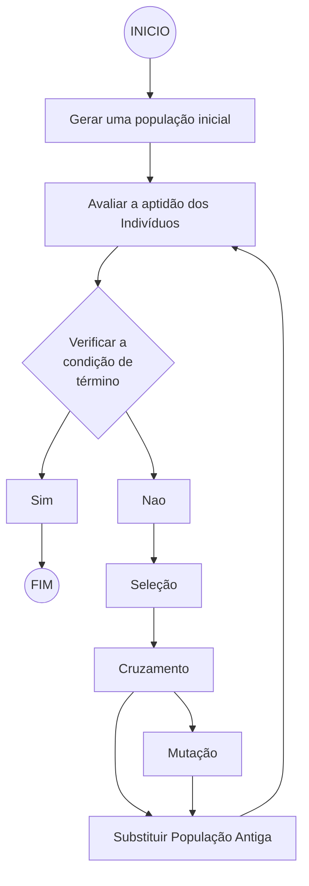

# Tech Challenge - Fase 2

## Turma
Grupo 16

### Integrantes

Jonathan Maximo da Silva
jonathan.desenv@gmail.com

Michael Juvenal de Oliveira
Michael.etec@gmail.com

Samuel Kazuo Watanabe
kazuo_w@hotmail.com

Samuel Rodrigues de Barros Mesquita Neto
samuelr.neto98@gmail.com

## Sobre o desafio

### O Problema
O desafio consiste em projetar, implementar e testar um sistema que utilize Algoritmos Genéticos para otimizar uma função ou resolver um problema complexo de otimização. Você pode escolher problemas como otimização de rotas, alocação de recursos e design de redes neurais.

### Requisitos do Projeto:

- Definição do Problema:
Escolha um problema real que possa ser resolvido por meio de otimização genética. Descreva o problema, os objetivos e os critérios de sucesso.

- Testes e Resultados:
Realize testes para demonstrar a eficácia do algoritmo. Compare os resultados obtidos com métodos de solução convencionais.

- Documentação:
Forneça uma documentação completa do projeto, incluindo descrição do problema, detalhes da implementação do algoritmo, análises de resultados e conclusões.

### Entregável:

1. Código fonte do projeto: deve incluir todos os scripts e códigos utilizados na implementação do algoritmo genético.
2. Documento detalhado descrevendo o problema, a abordagem utilizada, os resultados obtidos e as conclusões.
3. Um vídeo explicativo do projeto, demonstrando a aplicação prática do algoritmo e discutindo os resultados obtidos.

---

## Problema Proposto:

Somos uma empresa XPTO de entregas, onde possuímos uma pequena frota de caminhões de porte pequeno que realizam entregas somente dentro da cidade de São Paulo.

Desenvolvemos um aplicativo para os motoristas com objetivo de indicar a melhor rota para as entregas. Nossos motoristas recebem de manhã todas as encomendas do dia em nosso centro de distribuição e, a partir daí, o aplicativo traça a rota que o motorista deverá percorrer para realizar as entregas do dia.

Temos recebido constantes reclamações dos motoristas de que o aplicativo não traça boas rotas, o que aumenta o tempo para as entregas e percorrem uma distância muito maior. Com isso, há um aumento significativo de gastos com combustível e, também, muitas entregas tem sido entregues com muito atraso, o que impacta no horário de trabalho dos nossos motoristas.

Nosso time de tecnologia recebeu um desafio, visando melhorar as rotas para que a empresa possa reduzir os custos, e aumentar também a eficiência nas entregas.

Obs.: Não vamos considerar as ruas ou sentidos das vias, somente localização/posição (x, y)

### Primeira entrega de valor (MVP)

O time de tecnologia ficou responsável por criar uma primeira entrega de valor, onde a solução será um algoritmo que possibilite analisar a melhor rota possível para cada ponto de entrega de cada motorista, fazendo percorrer o menor caminho possível (baseado no exemplo do "Caixeiro Viajante").

A idéia principal é que o algoritmo, de forma inteligente, vá aprendendo e otmizando a rota o melhor possível.

### Como fazer?

- O time de tecnologia pretende criar um algoritmo baseado em GenAI, ou seja, em algoritmo genético, que seja capaz de analisar a melhor rota, baseado nos pontos de entrega, levando em consideração o ponto inicial de saída do motorista, que seria a localização do centro de distribuição.

Lembrando que o fluxo abaixo nos mostra as etapas dos algoritmos genéticos, que nos baseamos para a montagem do projeto:

Portanto, o algoritmo deverá:

#### 1. Gerar a população inicial
A população inicial será gerada através da criação de rotas aleatórias baseados nos pontos de entrega que deverão ser efetuadas, até o máximo definido para o tmanho da população.

#### 2. Avaliar a aptidão dos indivíduos (fitness)
Para avaliarmos a aptidão dos indivíduos, vamos considerar o cálculo da distância total de cada rota da população, lembrando que, para diferenciar neste projeto, será considerado como ponto inicial a localização do centro de distribuição, que será onde o motorista deverá iniciar a partida para as suas entregas.

#### 3. Verificar a condição detérmino
Neste caso, decidimos por definir uma quantidade limite de gerações.

#### 4. Seleção
Com base num valor definido vamos pegar uma amostragem da população e considerar o menor valor encontrado, selecionando 2 indivíduos a cada passagem

#### 5. Cruzamento (Crossover)
Vamos considerar de forma aleatória um índice para realizar o cruzamento entre os indivíduos

#### 6. Mutação
Vamos gerar os descendentes baseados no cruzamento dos indivíduos selecionados anteriormente, sendo o posicionamento para o crossover para realizar a mutação

#### 7. Substituir População Antiga
A cada iteração, será gerada nova população com os descendentes sempre calculando os menores trajetos

Ao fim da execução, o algoritmo deverá gerar o melhor trajeto que conseguir encontrar, informando a rota que o motorista deverá seguir. Desta forma, encerrando a aplicação.